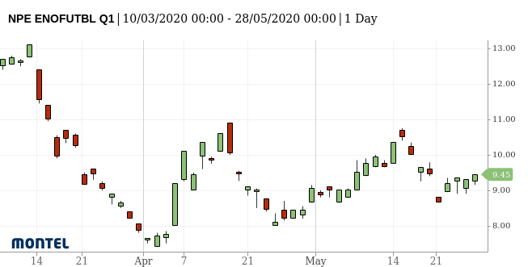

Terminology and data models
===========================

This page describes commonly used terms used in the API and the
Python client.

Curve
-----

A :py:class:`Curve <energyquantified.metadata.Curve>` describes any data
series. The curve's **name** is unique and identifies data series in the API.
The Curve-model contains all the meta-information which makes up its name, such
as categories, areas, unit and others.

An important attribute on the curve model is :ref:`resolution <resolution>`
(more on resolutions below). It tells you the time step (hourly, 15-minute,
daily, etc.) and time zone for data in the curve.

**Curve types**

Another essential detail is the ``curve_type`` attribute. This attribute
describes what kind of data the curve stores. There different types are:

- ``TIMESERIES``
- ``SCENARIO_TIMESERIES``
- ``INSTANCE``
- ``PERIODS``
- ``PERIOD_INSTANCES``
- ``OHLC``

The ``curve_type`` tells you which operations you shall use to load data
from the curve in the API.

Instance
--------

Some data series, such as those that contain forecasts, are not only one
series, but a collection of many series. We call each of these
series *instances*.

An :py:class:`Instance <energyquantified.metadata.Instance>` is identified by
the combination of two attributes: An **issue date** (date-time) and a **tag**
(string).

For instance, Energy Quantified's forecasts based on the weather
forecast `ECMWF <https://www.ecmwf.int/>`_ uses ``tag = 'ec'`` and the
issue date as specified by ECMWF. So the morning forecast has these
attributes:

.. code-block:: python

   # ECMWF deterministic forecast at midnight on 1 January 2020
   instance.issued = datetime(2020, 1, 1, 0, 0, 0, 0, tz=UTC)
   instance.tag = 'ec'

Time series that are instances (forecasts) have an ``instance`` attribute.

Place
-----

The :py:class:`Place <energyquantified.metadata.Place>` model is a rather
generic: It represents anything that has a geographical location, and
therefore it has a latitude and longitude.

Places have a ``type`` attribute describing what you may find in this
place! These types are currently:

- ``producer`` – Powerplant. Where available, you will also get a ``fuel``
  attribute with the production type (wind, solar, nuclear, etc.).
- ``consumer`` – Factory or otherwise large consumer of power
- ``weatherstation`` – A weather station
- ``river`` – A point on a river (used for river temperature forecasts at
  critical locations)

Curves may be linked to a place (for instance actual production for a
nuclear power plant). And a place has a list of all curves connected to
it.

Resolution, time-zone and frequency
-----------------------------------

Power markets operate on contracts such as 15-minute, hourly, daily,
weekly, monthly, quarterly and yearly. We call these different time
intervals for **frequencies**.

Frequency
~~~~~~~~~

A frequency is a time step. We use mostly **ISO-8601**-style naming of
frequencies, but with a few exceptions. See
`Duration (Wikipedia) <https://en.wikipedia.org/wiki/ISO_8601#Durations>`_
for an excellent explanation of the format.

- ``P1Y`` – Yearly
- ``SEASON`` – Summer or winter
- ``P3M`` – Quarterly
- ``P1M`` – Monthly
- ``P1W`` – Weekly
- ``P1D`` – Daily
- ``PT1H`` – Hourly
- ``PT30M`` – 30 minutes
- ``PT15M`` – 15 minutes
- ``PT10M`` – 10 minutes
- ``PT5M`` – 5 minutes

The ``SEASON`` frequency is used for gas market contracts. It starts on 1
April (summer) or 1 October (winter) and lasts six months.

Besides, the following frequency constant is used when data does not follow a
fixed interval (such as tick data). It is an invalid frequency for operations
that involve the Timeseries model.

- ``NONE`` – No frequency specified (i.e. tick data)

See the :py:class:`Frequency <energyquantified.time.Frequency>` enum class
for more details.

Time-zone
~~~~~~~~~

These are the most commonly used time-zones. Most power markets in Europe
operate in CET due to standardization and market coupling.

- ``UTC`` – Coordinated Universal Time
- ``WET`` – Western European Time
- ``CET`` – Central European Time
- ``EET`` – Eastern European Time
- ``Europe/Istanbul`` – Turkey Time
- ``Europe/Moscow`` – Russian/Moscow Time
- ``Europe/Gas_Day`` – (Non-standard time-zone; not in the IANA time-zone database)
  European Gas Day at UTC-0500 (UTC-0400 during Daylight Saving Time). Starts
  at 06:00 in CE(S)T time. Used for the natural gas market in the European
  Union.

We use the `pytz <https://pypi.org/project/pytz/>`_ library for time-zones.

.. _resolution:

Resolution
~~~~~~~~~~

It is a combination of a frequency and a time-zone. All time series have a
resolution. Only resolutions with iterable frequencies are iterable (meaning
all frequencies other than ``NONE``).

With Energy Quantified's Python library, you can do something like this:

    >>> from energyquantified.time import (
    >>>    Resolution, Frequency, UTC, get_datetime
    >>> )
    >>> resolution = Resolution(Frequency.P1D, UTC)
    >>> begin = get_datetime(2020, 1, 1, tz=UTC)
    >>> end = get_datetime(2020, 1, 5, tz=UTC)
    >>> for d in resolution.enumerate(begin, end):
    >>>     print(d)
    2020-01-01 00:00:00+00:00
    2020-01-02 00:00:00+00:00
    2020-01-03 00:00:00+00:00
    2020-01-04 00:00:00+00:00

Of course, you could use ``datetime.timedelta`` from the standard Python
library to achieve a similar result. However, ``datetime.timedelta`` does not
handle the transition from/to daylight saving time. Using the ``Resolution``
will make sure that the date-times get the right offset from UTC.

See the :py:class:`Resolution <energyquantified.time.Resolution>` class for
a full reference.

Aggregation and filters
-----------------------

Aggregation
~~~~~~~~~~~

*To aggregate* means *to downsample data* to a lower resolution. Example:
Convert hourly values to daily values.

When aggregating, you must choose a strategy for how to calculate the
aggregated value. The supported aggregations are:

 * ``AVERAGE`` – The mean of all input values
 * ``SUM`` – Sum of all input values
 * ``MIN`` – Find the lowest value
 * ``MAX`` – Find the highest value

Energy Quantified defaults to use ``AVERAGE`` (mean).

Class reference: :py:class:`Aggregation <energyquantified.metadata.Aggregation>`

Filters (or hour-filters)
~~~~~~~~~~~~~~~~~~~~~~~~~

You can also apply filters on which *hours* you want to include in aggregations.

In the power markets, one typically make a distinction between **base**
and **peak** hours. Some weekly contracts traditionally also separate
workdays from weekends. Here are some explanations:

- ``BASE`` – All hours
- ``PEAK`` – Peak hours (8-20). For future contracts: Peak hours (8-20) during workdays
- ``OFFPEAK`` – Offpeak (0-8 and 20-24). For future contracts: Offpeak hours (0-8 and  20-24) during workdays and all hours during the weekend
- ``WORKDAYS`` – Monday, Tuesday, Wednesday, Thursday, Friday
- ``WEEKENDS`` – Saturday, Sunday

**Important:** When loading aggregated time series data from the API, you
should keep the following in mind:

- For weekly, monthly, quarterly and yearly resolutions, ``PEAK`` is defined as
  ``PEAK`` hours during ``WORKDAYS`` (8-20 during workdays). ``OFFPEAK`` is, for
  the same resolutions, defined as ``OFFPEAK`` hours during ``WORKDAYS`` and
  all hours during ``WEEKENDS``.
- For daily resolutions, ``PEAK`` and ``OFFPEAK`` do not make a distinction
  between workdays and weekends.

Class reference: :py:class:`Filter <energyquantified.metadata.Filter>`

Aggregation threshold
~~~~~~~~~~~~~~~~~~~~~

By default, the aggregation returns empty values whenever one or more input
values are missing. You can set a *threshold* that defines how many values are
allowed to be missing within a frame of the converted frequency. If the number
of missing values is less than or equal to the *threshold*, aggregation is
performed on the remaining non-empty values. Otherwise, an empty value is
returned.

**Note**: By default, the threshold is set to zero. This means that an empty
input value will result in an empty output value.

For example, you want to convert hourly values to daily values using the mean
value. Let's assume that some input values are missing. Instead of getting
empty values, you want to get the average if a maximum of four values are
missing within a day. In this case, set the *threshold* to four.

.. _time-series:

Time series
-----------

A :py:class:`Timeseries <energyquantified.data.Timeseries>` is a data series
with date-times as the index. Time series in Energy Quantified's API has a
**fixed** interval (i.e. 15-minute, hourly, daily). For time series with
varying duration per item, see [Period series](#period-series).

Example of a time series:

.. code-block::

   Date         Value
   ----------  ------
   2020-01-01   145.2
   2020-01-02   156.9
   2020-01-03   167.4
   2020-01-04   134.1
   ...

Time series data can have a varying number of values per date-time:

- **Single-value**: Each ``date-time`` has one corresponding value.
- **Scenarios**: Each ``date-time`` has multiple values.
- **Scenarios with mean value**: Each ``date-time`` has multiple values and a
  mean value of those scenarios.

Scenarios are sometimes also referred to as **ensembles**. This terminology
comes from meteorology, where forecasts with multiple scenarios are called
ensemble forecasts. For instance, the ECMWF ensemble forecast has 51 scenarios,
and the GFS ensemble forecast has 21 scenarios.

Period series
-------------

While :ref:`Time series' <time-series>` are excellent for representing
fixed-interval data, some time series data can be stored and served more
efficient.

For instance, there are plenty of capacity plans published in the power
markets (i.e. `REMIT <https://www.energyquantified.com/features/remit>`_).
Another example is assumptions on installed capacity on different fuel types
in the future. Such data often have the same value over an extended period,
and the value changes sporadically.

So Energy Quantified created what we call a
:py:class:`Periodseries <energyquantified.data.Periodseries>` for this, which
is a collection of date-time ranges with a **begin** date-time, an **end**
date-time, and a corresponding **value**.

The client also supports converting any such period series to a time series
in your preferred resolution.

Example of a period series:

.. code-block::

   Begin       End          Value
   ----------  ----------  ------
   2020-01-01  2020-01-05     300    #  4 days
   2020-01-05  2020-02-01     125    # 27 days
   2020-02-01  2020-02-13     160    # 12 days
   2020-02-13  2020-02-14     220    #  1 day
   ...

Period-based series has two different types of periods:

- **Period with a value**: Each period has one corresponding value, like in
  the example table above.
- **Period with a value and a capacity**: Each period has a current value
  and a total installed capacity. These types of values appear mostly in
  REMIT data, where the value is the currently available production capacity,
  while the total installed capacity is provided for reference.

OHLC
----

End-of-day statistics for financial contracts. OHLC stands for *open,
high, low and close*, and is a summary of trades for a day.
OHLC is typically used to illustrate movements in the price of a financial
instrument and can be seen in financial charts looking like candlesticks.

In cooperation `Montel <https://www.montelnews.com/>`_, Energy Quantified
provides :py:class:`OHLC <energyquantified.data.OHLC>` data for all power
market regions in Europe, as well as prices for gas markets, carbon emissions
(EUA), brent oil and coal (API2).

**Example:** Nord Pool future contract for a front quarter contract (Q1).

SRMC
----

In the power market, the **short-run marginal cost** of running power plants. See
`short-run marginal cost <https://en.wikipedia.org/wiki/Cost_curve#Short-run_marginal_cost_curve_(SRMC)>`_
on Wikipedia for a broader definition.

Energy Quantified allows SRMC calculations for gas- and coal-fired power
production.

-----

Next steps
----------

Learn how to :doc:`connect to the API <../userguide/auth>` and
to :doc:`discover data <../userguide/metadata>`.